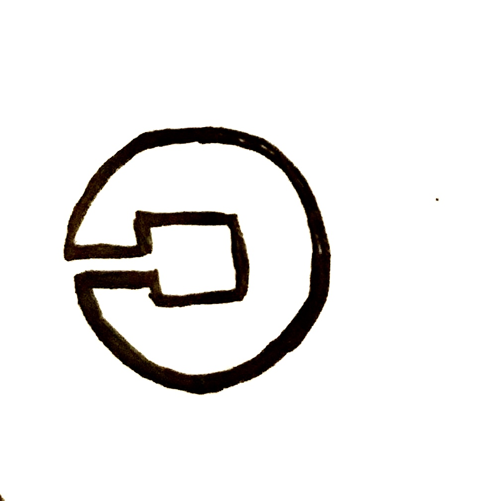
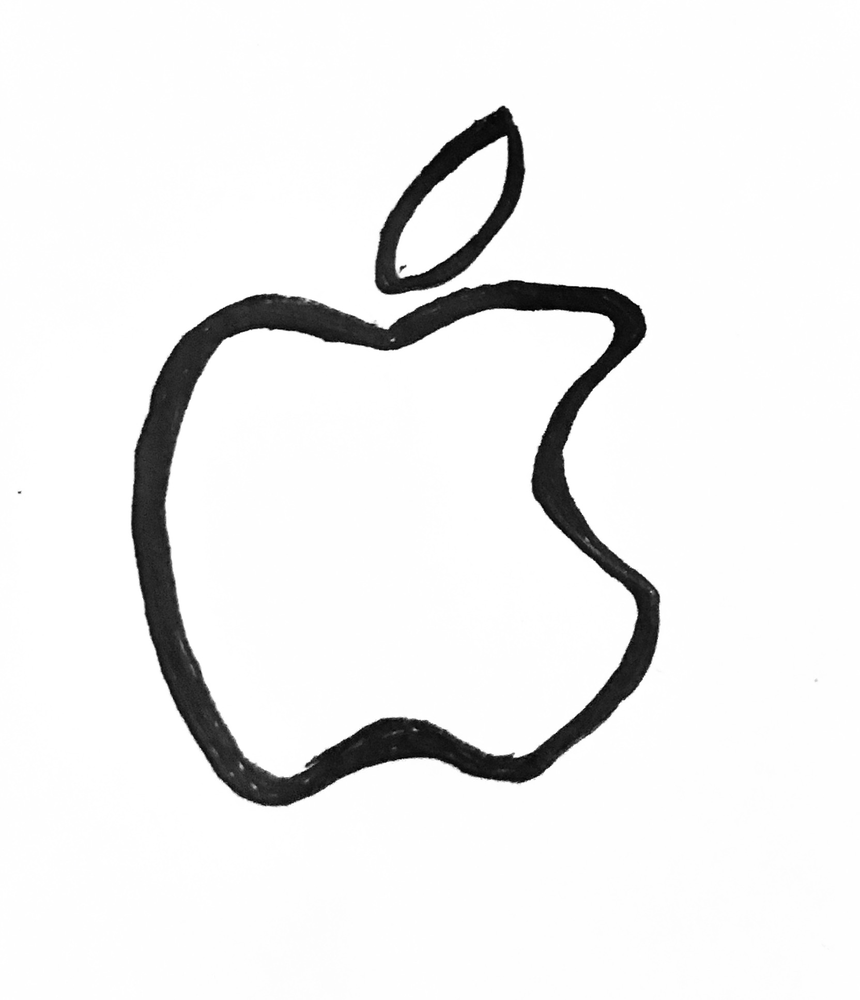
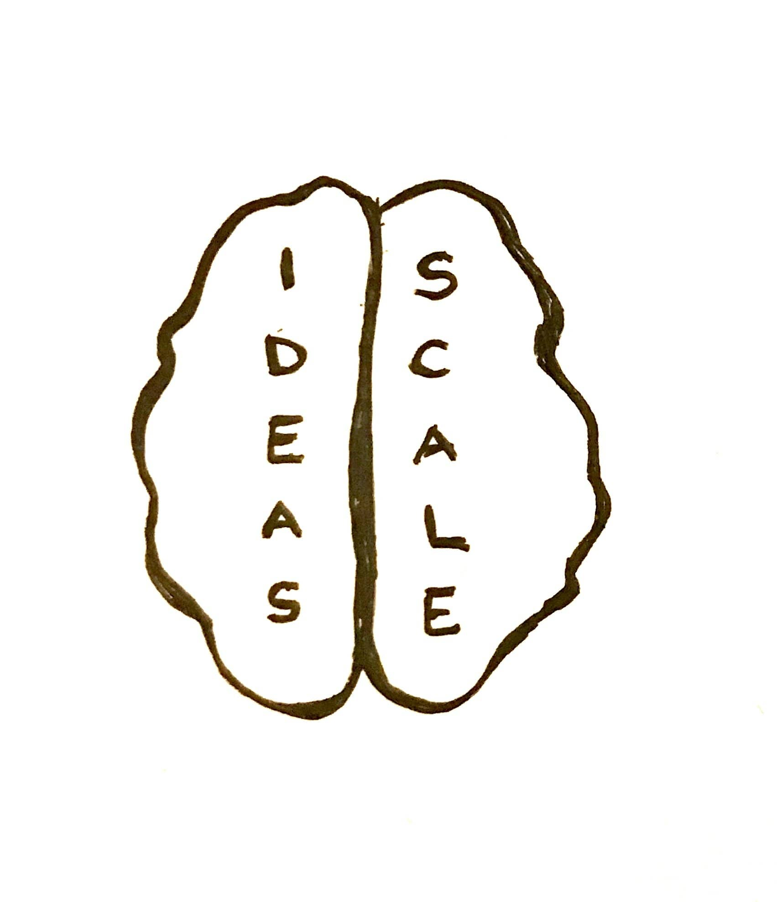

# Exponential Organization

---
__Based on _"Exponential Organizaion"_ - Salim Ismail__ 
>Why new Organizations are ten times better, faster, and Cheaper than yours

---

## Definition

>An __Exponential Organization__ is one whose impact or output is disproportionately large _at least 10 times larger_ compared to its peers because of new organizational techniques that leverage accelerating technologies...

---
## Google as origin and focal point

How can you organize a digital organization to achieve __exponential output__?

---

## Alphabet Value Creation

Initial Public Offering on 19th August 2004

|   Date   |   Alphabet Share Value (Highest of the year)   |
|   ----   |   ----------------------------------------:    |
|   2004   |   77 €   |
|   2008   |   235 €   |
|   2012   |   296 €   |
|   2016   |   783 €   |
|   2020   |   1454 €   |

---

If you had invested in 2004 and held the shares until now, you would have made a __1788%__ profit.

---
## Moore's Law

Price and Performance of computation will double evey 18 months
* Applies to IT
* Information enables doubling
* Continous process
* Key technologies AI, robotics, biotech, data science, 3D printing etc.

__Velocity and Intensity of Shifts is increasing__

--- 
Menti
---
## Exponential Organization Examples

* 
* 
* 
* 
* 
* 

---
## Technologic Advancement enables Cost Reduction

* 3D Printing: USD 40.000 in 2007 to USD 100 in 2014
* Industrial Robotics: USD 500.000 in 2008 to USD 22.000 in 2013
* Technological Drones: USD 100.000 in 2007 to USD 700 in 2013
* BioTech (DNA Sequencing): USD 10.000.000 in 2007 to USD 1.000 in 2014

Projected Costs are decreasing 

---

## Disruption

Exponential Organization can manage information-based world 
Merits: Radical transformation is not possible without changing nature of organization 
Exponential Organization represents the structure to address _accelerated_, _non-linear_ and _web-driven_ pace of the modern world

---
### Massive Tranformation Purpose
 <!-- .element height="50%" width="50%" -->

---

### Massive Transportation Purpose
|          |   |
|   ----   |   ----------------------------------------   |
|   _S_   |   Staff on demand   |
|   _C_   |   Community (attract, nurture, platform) & Crowd (harness creativity, innovation and validation)   |
|   _A_   |   Algorithms (Machine learning and Deep Learning)   |
|   _L_   |   Leveraged Assets (Non-Ownership)   |
|   _E_   |   Engagement (Ranking, Rules, Goals, Rewards, Ecosystem)   |

---

## Creating Exponential Organization

* Interfaces
* Dashboards to adapt objectives and key results
* Experimentation
* Autonomy creates innovative culture
* Social Technologies

---

## Exponential Organization Ecosystem

- Bild p.59 - p. 62

---

## Starting an Exponential Organization
- Bild p. 64 - 66

* Timeless obsticles: Technology risk, Market risk, Execution risk
* Join or crate Massive tranformation purpose
* Business Model Canvas (market penetration)
* Define Business Model

---
## Turning the traditional Organization inside out

|   Traditionel Organization   |   Exponential Organization   |
|   ----   |   ----------------------------------------:    |
|   Owning assets / workforce   |   Leverage external resources   |
|   Internal assets value the most   |   Information is greatest asset   |
|   Product introduction in 250 - 300 days   |   Product introduction in 29 days   |
|  Focus on core comepetencies   |   Think / aim big with MTP   |
|   Innovation through strategical planning   |   Community & Crowd, Experimentation, Autonomy   |
|   Process inflexibility   |   Dashboard, adapting organization with objectives and key results   |

---

## Exponential Organization Performance Improvement and Market Capitalization

p.86 and 87

Airbnb 
Github
Tesla

---

## Exponential Executive

Pressure to go exponential
* no time to hesitate on decision-making
* advancing technologies
* organizational developments

---

## Key Takeaways on Exponential Organization

* Massive Transportation Purpose
* SCALE 
* Is this the Organization form to start a business in the digital age? 

---
Bild "ausgeprägtes Gehirn" 