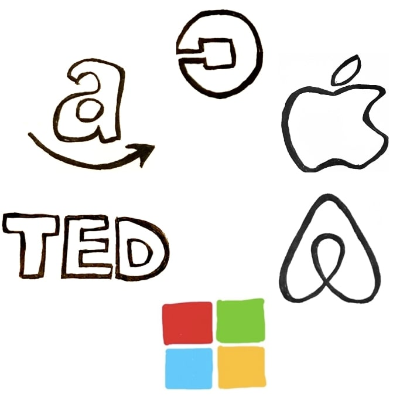

# Exponential Organization

<!-- .element height="85%" width="85%" -->

---
__Based on _"Exponential Organizaion"_ - Salim Ismail__ 
>Why new organizations are ten times better, faster, and cheaper than yours

<!-- .element height="50%" width="50%" -->

---

### Definition

>An __Exponential Organization__ is one whose impact or output is disproportionately large, _at least 10 times larger_, compared to its peers because of new organizational techniques that leverage accelerating technologies (...)

---
### Google as origin and focal point

How can you organize a digital organization to achieve __exponential output__?

---

### Alphabet Value Creation

Initial Public Offering on 19th August 2004

|   Date   |   Alphabet Share Value (Highest of the year)   |
|   ----   |   ----------------------------------------:    |
|   2004   |   77 €   |
|   2008   |   235 €   |
|   2012   |   296 €   |
|   2016   |   783 €   |
|   2020   |   1454 €   |

---

If you had invested in 2004 and held the shares until now, you would have made a __1788%__ profit.

---
## Moore's Law

* Every two years (18 months) the number of transistors on a CPU doubles
* Today's processors are roughly 100.000 x more powerful than those 30 years ago
---
### Moore's Law as underlying principle
* Applies to IT
* Information enables doubling
* Continous process
* Key technologies AI, robotics, biotech, data science, 3D printing etc.

__Velocity and Intensity of Shifts is increasing__

---
--- 

Scan the QR code or go to https://www.menti.com and enter the code 8360867

<!-- .element height="40%" width="40%" -->

---
### Exponential Organization Examples

<!-- .element height="50%" width="50%" -->

---
### Technologic Advancement enables Cost Reduction
|   Technology   |   2007   |   2014   |
|   ----------   |   :--:   |   :--:   |
|   3D Printing   |   USD 40.000   |   USD 100   |
|   Industrial Robotics   |   USD 500.000   |   USD 22.000   |
|   Technological Drones   |   USD 100.000   |   USD 700   |
|   BioTech (DNA Sequencing)   |   USD 10.000.000   |   USD 1.000   |
---

## __Projected Costs are decreasing__ 

---

### Disruption

Exponential Organizations manage information-based world 
>Merits: Radical transformation is not possible without changing nature of organization

>Exponential Organization represent the structure to address __accelerated__, __non-linear__ and __web-driven__ pace of the modern world

---
### Massive Tranformation Purpose
 <!-- .element height="45%" width="45%" -->

---
### Creating Exponential Organization
|          |   |
|   ----   |   ----------------------------------------   |
|   _I_   |   Interfaces   |
|   _D_   |   Dashboards to adapt objectives and key results   |
|   _E_   |   Experimentation   |
|   _A_   |   Autonomy creates innovative culture   |
|   _S_   |   Social Technologies   |

---
### Massive Transportation Purpose
|          |   |
|   ----   |   ----------------------------------------   |
|   _S_   |   Staff on demand   |
|   _C_   |   Community (attract, nurture, platform) & Crowd (harness creativity, innovation and validation)   |
|   _A_   |   Algorithms (Machine learning and Deep Learning)   |
|   _L_   |   Leveraged Assets (Non-Ownership)   |
|   _E_   |   Engagement (Ranking, Rules, Goals, Rewards, Ecosystem)   |

---
### Exponential Organization Ecosystem

---

### Starting an Exponential Organization
 <!-- .element height="55%" width="55%" -->

---
### Turning the traditional Organization inside out

---
|   Traditionel Organization   |   Exponential Organization   |
|   :----   |   ---:    |
|   Owning assets / workforce   |   Leverage external resources   |
|   Internal assets value the most   |   Information is greatest asset   |
|   Product introduction in 250 - 300 days   |   Product introduction in 29 days   |

---
|   Traditionel Organization   |   Exponential Organization   |
|   :----   |   ---:      |
|  Focus on core comepetencies   |   Think / aim big with MTP   |
|   Innovation through strategical planning   |   Community & Crowd, Experimentation, Autonomy   |
|   Process inflexibility   |   Dashboard, adapting organization with objectives and key results   |

---

### Exponential Organization Performance Improvement 

 <!-- .element height="55%" width="55%" -->
 <!-- .element height="50%" width="50%" -->
 <!-- .element height="65%" width="65%" -->

---

### Exponential Executive

Pressure to go exponential
* no time to hesitate on decision-making
* advancing technologies
* organizational developments

---

### Key Takeaways on Exponential Organization

 <!-- .element height="70%" width="70%" -->